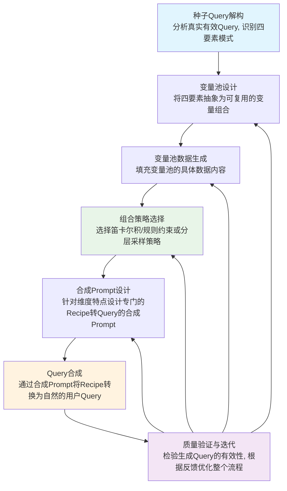
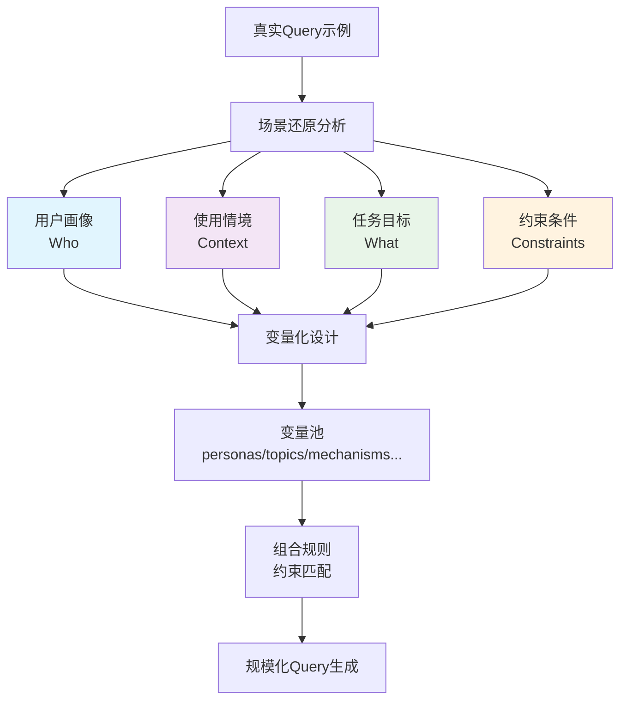

# Query构造思路与方法

## 1. 概述

本文档提供一套标准化的Query构造方法论，实现高质量Query的规模化生产。

**完整构造流程**:



## 2. 核心构造理念（共性）

尽管各个维度各有侧重，但其底层的Query构造理念是相通的。我们并非一开始就拥有了成熟的方法论，而是通过对"种子Query"的解构和归纳，逐步演进出一套标准化的构造框架。本章节将还原这一思考过程。

### 2.1 种子Query解构：三维度共性分析

我们从三个维度的原始需求和真实种子Query入手，通过解构分析寻找有效Query背后的共同构造逻辑。

**复杂指令遵循维度**
- **原始需求**: 目前已知benchmark现状不佳，需要评估模型在面对线上用户自然语言复杂指令时的遵循能力，希望构建一批query进行体系化测试
- **种子Query**: "请撰写一篇关于社区共享雨伞系统用户体验与维护策略的分析报告，文章需分为背景概述、问题梳理与改进建议三个部分。报告须使用中文撰写，每个句子的汉字字数最少18个、最多26个，内容应逻辑清晰、结构严谨，不得使用第一人称叙述。"
- **解构特征**: 用户画像相对模糊，使用情境是工作场景，任务目标非常明确（写报告），约束条件密集且具体（结构+字数+人称限制）

**复杂意图理解维度**  
- **原始需求**: 用户Query容易因为表述不清导致AI产生理解偏差，需要设计有效方法来测试AI对复杂、模糊意图的理解能力
- **种子Query**: "你好，我准备上一堂展示课，内容为思想道德与法治的社会主义核心价值观的人民性，面对的学生专业是智慧健康养老服务与管理，请设计一些问题链"
- **解构特征**: 用户画像明确（老师），使用情境清楚（备课），任务目标明确（设计问题链），约束条件具体（针对人民性主题，结合养老专业背景）

**幽默感维度**
- **原始需求**: 幽默理解评估集，测试AI的幽默识别、理解和生成能力
- **种子Query**: "周六在家陪娃写作业，同事约我出去玩，我说娃要考试了，他说我卷王，我该怎么幽默的回复"
- **解构特征**: 用户画像是家长，使用情境是社交回复需求，任务目标相对简单（想回复），约束条件多为抽象（要幽默、要合适）

**共性归纳：**通过三维度解构，我们发现所有有效Query都围绕四个核心要素进行精心设计，只是每个维度对这些要素的依赖强度不同。

### 2.2 核心四要素及其维度差异

基于三维度种子Query解构，我们总结出Query构造的四个核心要素，但不同维度对这些要素的依赖强度截然不同：

**四要素定义：**
- **用户画像**: 谁在提问，决定语言风格和视角
- **使用情境**: 什么场景下提问，影响复杂度和正式程度  
- **任务目标**: 要AI做什么，决定核心指令
- **约束条件**: 有什么限制，影响任务难度


| 维度 | 用户画像 | 使用情境 | 任务目标 | 约束条件 |
|---------|----------|----------|----------|----------|
| 复杂指令遵循 | 身份模糊（需要写报告的人） | 正式工作场景 | 明确的产出要求（写分析报告） | 大量显性约束（字数、格式、结构） |
| 复杂意图理解 | 明确身份（老师） | 具体工作场景（准备展示课） | 明确任务（设计问题链） | 约束条件具体（针对人民性主题，结合养老专业背景） |
| 幽默感 | 具体身份（家长） | 具体生活场景（陪娃写作业） | 简单直接（想要回复） | 主要是抽象约束（要幽默、要合适） |

**图1：Query构造四要素关系**


### 2.3 变量设计方法论：从四要素到变量池

#### 2.3.1 什么是变量？

变量设计的本质是将四要素中的关键信息抽象为可复用的组件。变量就是将场景和角色具体化的元素。

例如，在"复杂指令遵循"场景中：
- **报告主题** (`topic`) 是一个变量。它可以是"社区共享雨伞"，也可以是"城市交通拥堵"。
- **句子长度约束** (`sentence_length`) 是一个变量。它可以是"18-26个字"，也可以是"30-40个字"。
- **特定词约束** (`specific_word`) 也是一个变量。可以是"第二段第八个字必须是'路'"，也可以是其他要求。

通过排列组合这些变量，一个抽象的"报告撰写"场景就能生成成百上千个具体的、独一无二的Query。

#### 2.3.2 变量设计的基本方法

👤 **用户画像变量设计**
可以从身份、背景、特征等维度设计personas变量。比如职业身份（"程序员"、"老师"）、地域背景（"南方人"、"东北人"）、年龄代际（"00后"、"80后"）。不同的personas会影响Query的语言风格、关注重点和文化背景。

🏢 **使用情境变量设计**  
可以设计application_scenarios（使用目的）和context_richness（背景丰富度）等变量。使用目的影响Query的正式程度和复杂度，背景丰富度直接控制Query的篇幅长短。

🎯 **任务目标变量设计**
可以设计task_types变量来控制要构造的具体任务类型。比如在幽默感维度可以设计"幽默识别"、"场景应用"、"内容创作"等不同任务类型，每种类型会产生完全不同的Query结构。

⚙️ **约束条件变量设计**
可以设计mechanisms（技巧要求）、material_types（素材类型）等变量。这些变量直接影响Query的难度和构造精度。

💭 **设计讨论：如何确定核心变量vs可选变量？**

```markdown
在设计变量池时，需要区分核心变量和可选变量以控制Recipe复杂度：

**核心变量标准**：
- 直接影响测试维度的关键变量（如幽默感的`mechanism`）
- 决定Query基础结构的变量（如`task_type`、`persona`）
- 缺失会导致测试失效的变量

**可选变量标准**：
- 增强Query丰富度但非必需的变量（如`context_richness`、`style`）
- 过多使用会导致Recipe过于复杂的变量
- 可以有默认值或省略的变量

实践建议：先用核心变量验证生成效果，再逐步添加可选变量找到最佳平衡点。
```

#### 2.3.3 变量组合策略

根据构造目标，可以选择不同的组合策略：

**1. 笛卡尔积 (Cartesian Product)**

当变量之间相互独立，任何组合都有意义时，我们采用笛卡尔积来生成最全面的Query集。

- **适用场景**: 变量之间没有强逻辑约束的场景。
- **示例1**: 在"复杂指令遵循"维度中，`scenarios`（市场分析、软件开发）和`instructions`（总结、对比）是相互独立的，任何场景都可以搭配任何指令组合。通过叉乘，可以高效生成如"总结+对比市场分析"、"总结+对比软件开发"等大量组合。
- **示例2**: `constraints`（格式约束、长度约束）与`styles`（简洁明了、详细阐述）之间也相互独立，任何约束都可以配任何风格。
- **示例3**: 在幽默感维度中，`application_scenarios`（社交回复、内容创作）和`mechanisms`（自嘲、夸张）可以自由组合，每种场景都能使用各种幽默技巧。

💭 **设计讨论：什么情况下不能直接做笛卡尔积？**

```markdown
笛卡尔积虽然高效，但在以下情况下会产生问题组合：

- **逻辑冲突**: 如"小学生×职场话题"
```

**2. 逻辑映射与约束 (Logical Mapping & Constraints)**

当存在上述问题时，需要通过规则约束确保组合合理性：

- **适用场景**: 变量间存在依赖关系的复杂场景
- **实现方式**: 定义`allowed_combinations`规则，避免不合理组合，确保生成的Query逻辑合理且具有测试价值

### 2.4 变量池数据生成

在设计好变量池结构后，需要为每个变量池填充具体的数据内容。

**数据生成策略**:
- **真实数据提取**: 从用户日志、社区问答等真实场景中提取变量内容  
- **专家人工构造**: 针对特定测试需求手工设计高质量变量
- **AI辅助生成**: 使用大模型批量生成personas、topics、scenarios等变量的具体值

**质量控制原则**:
- **多样性**: 确保同类变量内容覆盖足够广泛的场景
- **真实性**: 变量内容应贴近真实用户的表达习惯

**实际示例**:

**复杂指令遵循变量池数据**:
- `scenarios`: ["市场分析", "软件开发", "生活健康", "教育学习", "内容创作", "旅行规划"]
- `instructions`: ["总结", "对比", "创作", "列举", "解释", "规划", "翻译", "重写"]  
- `constraints`: 包含6类共15+种约束（"不要包含任何关于价格的信息"、"请用Markdown表格来展示结果"、"请将回答控制在300字以内"等）

**幽默感变量池数据**:
- `personas`: 40+种身份（"一个程序员"、"一个东北人"、"一个社恐"、"00后vs80后对比观察者"等）
- `topics`: 40+种话题（"职场"、"东北澡堂子"、"微信群聊"、"代际差异"等）
- `mechanisms`: 10种幽默技巧（"自嘲"、"夸张"、"谐音梗"、"反转"、"讽刺"等）

**复杂意图理解变量池数据**:
- `scenarios`: 4种场景（"产品反馈"、"求职咨询"、"课堂设计"、"生活规划"）
- `hidden_intents`: 5种隐性意图（"获得情感支持"、"找理由说服老板"、"希望找到省钱方案"等）
- `contexts`: 5种情境注入（"我最近工作压力特别大"、"我们团队最近预算很紧张"等）

💭 **设计讨论：变量值应该更具体还是更抽象？**

在填充变量池时，一个关键决策是变量值应该多具体还是多抽象：

**具体化示例**:
- ❌ 抽象: "一个互联网公司"  
- ✅ 具体: "阿里巴巴"、"腾讯"、"字节跳动"

```markdown
**具体化的优势**:
- **避免虚假需求**: 使用真实存在的公司、产品避免让模型处理不存在的实体，防止产生无意义的测试

**抽象化的优势**:
- **扩展灵活性**: 抽象描述给合成模型更多发挥空间
- **减少偏见**: 避免因特定品牌或实体引入测试偏差

**实践建议**: 根据变量类型和测试目标选择合适的具体化程度。对于entities类变量（公司、产品），建议使用具体值；对于scenarios类变量，可以适当保持抽象以增加灵活性。
```

## 3. 各维度的构造方法（差异）

在通用的构造框架下，不同维度通过调整**场景、指令和变量**来体现其独特性。

### 3.1 复杂指令遵循 (Complex Instruction Following)

此维度采用**笛卡尔积组合策略**，通过多重约束的系统性耦合来测试模型的指令遵循能力。

**实际构造流程：**
1. **变量池定义**: 
   - `scenarios`: 6种主题场景（市场分析、软件开发、生活健康等）
   - `instructions`: 8种核心指令（总结、对比、创作、列举等）
   - `constraints`: 6类约束（否定、格式、长度、包含、风格、元指令）
   - `styles`: 4种Query表达风格

2. **组合策略**: 
   - instructions取2个进行组合 (`itertools.combinations(instructions, 2)`)
   - constraints取1个 (`itertools.combinations(constraints, 1)`)
   - 与scenarios和styles进行笛卡尔积全量组合
   - 随机打乱确保测试分布均匀

3. **Recipe结构示例**:
   ```yaml
   scenario: "市场分析"
   instructions: ["总结", "对比"]
   constraints: ["格式约束: 请用Markdown表格来展示结果"]
   style: "简洁明了，直奔主题"
   entities: [{"type": "公司", "value": "阿里巴巴"}, {"type": "产品", "value": "钉钉"}]
   ```

**构造特点**: 通过系统性的多指令耦合和精确约束组合，确保每个生成的Query都包含足够的复杂度来测试模型的指令遵循能力。

### 3.2 复杂意图理解 (Complex Intent Understanding)

此维度采用**规则约束组合策略**，通过显性任务与隐性意图的分离设计来测试模型的意图理解能力。

**实际构造流程：**
1. **变量池定义**:
   - `scenarios`: 4种核心场景（产品反馈、求职咨询、课堂设计、生活规划）
   - `main_tasks`: 5种显性任务（寻求反馈、设计方案、咨询建议等）
   - `hidden_intents`: 5种隐性意图（获得情感支持、找理由说服、省钱方案、获得模板、发现盲点）
   - `contexts`: 5种情境注入（工作压力、预算紧张、项目重要等）
   - `styles`: 2种表达风格

2. **组合策略**:
   - 基于`allowed_combinations`规则确定有效的scenario-main_task-hidden_intent组合
   - 例如："课堂设计"场景只能配"设计方案"或"寻找创意"任务，以及"说服老板"或"获得模板"意图
   - 有效核心组合再与contexts和styles进行全量组合

3. **Recipe结构示例**:
   ```yaml
   scenario: "课堂设计"  
   main_task: "设计一个...的活动方案"
   hidden_intent: "希望获得直接套用的模板"
   context: "我最近工作压力特别大，感觉很迷茫"
   style: "逻辑不太清晰，在陈述背景时有些啰嗦，但核心需求明确"
   entities: [{"type": "课程主题", "value": "思想道德与法治"}]
   ```

**构造特点**: 通过规则约束确保显性任务与隐性意图的逻辑合理性，测试模型能否在复杂表述中准确识别用户的真实需求层次。

### 3.3 幽默感 (Humor)

此维度采用**笛卡尔积+规则约束混合策略**，大部分变量可以自由组合，但某些特定组合需要规则约束来确保合理性。

**实际构造流程：**
1. **分层变量池定义**:
   - **Layer1 结构控制**: `task_types`(8种)、`context_richness`(3种)、`material_types`(3种)  
   - **Layer2 任务需求**: `mechanisms`(10种幽默技巧)、`application_scenarios`(5种)、`personas`(40+种)、`topics`(40+种)
   - **Layer3 语言风格**: `styles`(5种Query表达风格)

2. **组合策略**:
   - **核心变量组合**: `task_type`、`persona`、`topic`、`mechanism`作为必选变量进行组合
   - **可选变量控制**: `context_richness`、`material_type`、`application_scenario`、`style`根据需要选择性加入
   - **约束组合**: `personas`×`topics`通过`allowed_combinations`规则控制，确保搭配合理
   - **复杂度控制**: 通过调整参与组合的变量数量来控制Recipe复杂度，避免生成过于复杂的Query

3. **Recipe结构示例**:
   
   **简化版Recipe（仅核心变量）**:
   ```yaml
   task_type: "幽默识别"
   persona: "一个程序员" 
   topic: "职场"
   mechanism: "自嘲"
   ```
   
   **完整版Recipe（核心+可选变量）**:
   ```yaml
   task_type: "幽默识别"
   persona: "一个程序员" 
   topic: "职场"
   mechanism: "自嘲"
   application_scenario: "社交回复"
   context_richness: "详细情境"
   material_type: "无素材"
   style: "朋友圈求助风格"
   ```

**构造特点**: 通过核心变量和可选变量的灵活组合，控制Recipe复杂度，生成既自然又有效的幽默测试Query。

**实现要求**: 合成Prompt需要支持变量可选性，当可选变量缺失时能够正常工作。代码层面需要实现变量筛选逻辑，支持核心变量+可选变量的组合模式。

## 4. Query合成Prompt设计

在获得Recipe后，需要通过专门设计的合成Prompt将结构化的变量组合转换为自然的用户Query。不同维度需要不同的合成策略。

💭 **设计讨论：如何设计有效的合成Prompt？**

```markdown
合成Prompt设计面临多重挑战：

- **结构化信息自然化**: 如何将Recipe中的结构化要素自然融入Query中？
- **维度特异性体现**: 不同维度的测试重点如何在prompt中体现？
- **模型遵循稳定性**: 如何确保模型严格按照指令执行，不遗漏关键要素？
- **输出纯净性控制**: 如何防止模型输出多余的解释或标签？

核心挑战是平衡自然性与可控性：既要生成自然的用户Query，又要确保测试要素完整准确。
```

### 4.1 复杂指令遵循合成Prompt

**实际Prompt**:

```yaml
你是一位专业的、高质量用户Query构造专家。
你的任务是接收一个结构化的"Query配方"，并将其转换成一个单一的、听起来自然的用户Query。

**Query配方:**
- **场景:** {scenario}
- **核心动作:** {instructions}
- **约束条件:** {constraints}
- **表达风格:** {style}
- **必须使用的实体:** {entities}

**你的指令:**
1.  将配方中的所有要素（场景、核心动作、约束条件、表达风格）无缝地融合到一个连贯的用户Query中。
2.  **重要：** 在构造Query时，必须自然地使用上面提供的"必须使用的实体"，不能自己编造实体。
3.  **重要上下文提醒：** 牢记这是一个C端用户在对一个AI助手产品提问，而不是人与人之间的对话。Query的风格可以多样，但必须符合这个基本的人机交互场景。
4.  **重要：如果核心动作（如"总结"、"翻译"、"重写"）需要一段文本才能执行，你必须在Query中虚构并包含一段内容合理的示例文本（例如一段邮件、一篇文章摘要、几句代码等），确保整个Query是自包含的、可直接回答的。**
5.  **文化适配：** 虚构的内容（如人名、地名、公司名）必须优先使用中文，以贴合中国用户的使用习惯。
6.  **负向约束:** Query中不应包含"谢谢"、"请"、"麻烦你"等多余的礼貌性词语，模拟用户最直接的提问方式。
7.  必须严格遵循指定的"表达风格"来构造Query的语言。
8.  Query必须听起来自然，就像一个真人提出的问题。
9.  **至关重要：** 你的输出必须 **仅仅** 包含最终的用户Query文本，不要附加任何额外的解释、标签或引导性短语。
```

### 4.2 复杂意图理解合成Prompt  

**实际Prompt**:

```yaml
你是一位专业的、高质量用户Query构造专家，擅长模拟真实用户的模糊和隐含意图。
你的任务是接收一个结构化的"Query配方"，并将其转换成一个包含深层意图的、自然的、故事性的用户Query。

**Query配方:**
- **场景:** {scenario}
- **用户的表面任务:** {main_task}
- **用户的隐藏意图:** {hidden_intent}
- **补充背景:** {context}
- **表达风格:** {style}
- **相关实体:** {entities}

**你的指令:**
1.  将配方中的所有要素无缝地融合到一个连贯的、故事性的用户Query中。
2.  **不要**直接说出用户的"隐藏意图"，而是要通过情景描述和语气来暗示它。
3.  Query的核心应该是描述一个"困境"或"开放性问题"，而不是一个直接的指令。
4.  **文化适配：** 虚构的内容（如人名、地名、公司名）必须优先使用中文。
5.  **至关重要：** 你的输出必须 **仅仅** 包含最终的用户Query文本，不要附加任何额外的解释、标签或引导性短语。
```

### 4.3 幽默感合成Prompt

**实际Prompt**:

```yaml
你是一位专业的AI能力测试Query构造专家，专门设计用于评估AI模型幽默感的测试用例。

请根据以下配方生成一个C端用户向AI助手提问的Query：

**配方:**
- 任务类型: {task_type}
- 背景丰富度: {context_richness}  
- 素材类型: {material_type}
- 幽默技巧: {mechanism}
- 应用场景: {application_scenario}
- 用户人设: {persona}
- 主题领域: {topic}
- Query风格: {style}

**幽默技巧详解（含例子）:**
- **自嘲**: 通过贬低或调侃自己来制造幽默效果。例："我这智商稳定得很，从不被知识干扰"
- **夸张**: 将事物特征极度放大或缩小。例："这天气热得我出门摔一跤都能三级烫伤"
- **谐音梗**: 利用汉字读音相似制造语言游戏。
- **反转**: 突然改变预期方向，打破心理预设。
- **讽刺**: 通过反语批评嘲笑，表面褒扬实则贬低。例："您这智商挺稳定的，从不被知识干扰"
- **类比**: 将不相关事物对比突出相似性。
- **拟人化**: 给非人事物赋予人的特征。例："我的钱包很害羞，一见到好东西就脸红空了"
- **文化背景引用**: 引用熟知文化元素制造共鸣。
- **逻辑反转**: 颠倒正常因果逻辑。例："我不是懒，我是在为世界节约能源"
- **情感共鸣**: 描述普遍生活体验引起共鸣。

**任务类型分类和Query构造策略:**

**A类：幽默理解能力测试**
由于要测试幽默理解能力，构造的Query中需要提供幽默内容供分析
适用任务："幽默识别", "幽默程度排序"

构造方法：
1. 以{persona}身份，用{style}但相对正常的语调提问
2. 围绕{topic}主题提供包含{mechanism}技巧的幽默文本素材
3. 要求分析幽默技巧或进行排序，不要求创作新内容
4. 根据{context_richness}调整背景描述详细程度

**B类：幽默生成能力测试**
由于要测试幽默生成能力，构造的Query提出生成要求即可，自身不需要幽默
适用任务："内容改写", "场景应用", "点评总结", "内容续写", "内容扩写"

构造方法：
1. 以{persona}身份用{style}正常描述需求或情况
2. 提供正常的文本材料或场景描述  
3. 明确要求运用{mechanism}技巧进行幽默创作
4. 围绕{topic}主题和{application_scenario}构建真实使用场景

**C类：基于样本的创作能力测试**
由于要测试基于样本的创作能力，构造的Query需要提供幽默样本作为参考
适用任务："内容仿写"

构造方法：
1. 以{persona}身份用{style}描述创作需求
2. 提供包含{mechanism}技巧的幽默文本作为样本或开头
3. 要求模仿风格进行仿写/续写，或基于幽默素材进行扩写
4. 确保样本风格与{topic}和{application_scenario}匹配

**关键要求:**
1. **交互视角**: 用户直接跟AI对话，语气自然直接，不过分客套
2. **禁止称呼**: 不要使用"兄弟们"、"AI同学"、"家人们"等这类称呼，直接问即可
3. **真实表达**: 模拟真实用户的直接提问方式，少用"请您"、"能否"等客套话
4. **测试导向**: Query要能有效测试AI的幽默能力，确保明确提及要使用的{mechanism}幽默技巧
5. **正常表达**: 不要刻意使用某地方言

仅输出最终的用户Query文本：
```


## 5. 合成模型与Pipeline设计

在完成Recipe生成后，需要选择合适的模型将结构化配方转换为自然的用户Query。

### 5.1 模型选择考虑因素

**创造力要求**: Query合成需要一定的创造性和自然性，模型需要能够将结构化信息转换为流畅的自然语言

**指令遵循能力**: 需要严格按照合成Prompt的复杂要求执行，不能遗漏或误解配方中的任何要素

💭 **设计讨论：如何选择合适的合成模型？**

在实际应用中，模型选择往往需要在多个因素间权衡：

- **维度特异性 vs 通用性**: 某些维度（如幽默感）可能更适合本土化模型，但通用强模型在指令遵循上更可靠

实践中建议：根据项目具体约束确定最终选择。

### 5.2 多阶段Pipeline设计

**单阶段方案**: 使用单一强模型完成Recipe到Query的转换

**多阶段Pipeline方案**:
1. **阶段1-粗合成**: 选择适合该维度特点的模型进行基础Query生成，确保所有要素都被包含。比如幽默感是带有文化属性的，适合选择本土模型；如果没有特殊考虑，优先选择综合效果最好的模型
2. **阶段2-润色优化**: 基于一阶段生成的内容，调整表达方式使其更符合C端用户的自然表达习惯。部分模型不擅长遵循语言风格约束，会产生内容合理但表达奇怪的Query（如使用"AI"、"老兄"等不自然称呼），此阶段专门解决这类问题  
3. **阶段3-质量检查**: 用于过滤掉低质量的合成Query，剔除具有明显逻辑漏洞、内容矛盾或不符合维度测试要求的Query

**Pipeline选择原则**: 根据质量要求、成本预算和时间限制选择合适的方案。对于高质量要求的场景，建议使用多阶段Pipeline确保最终输出质量。

